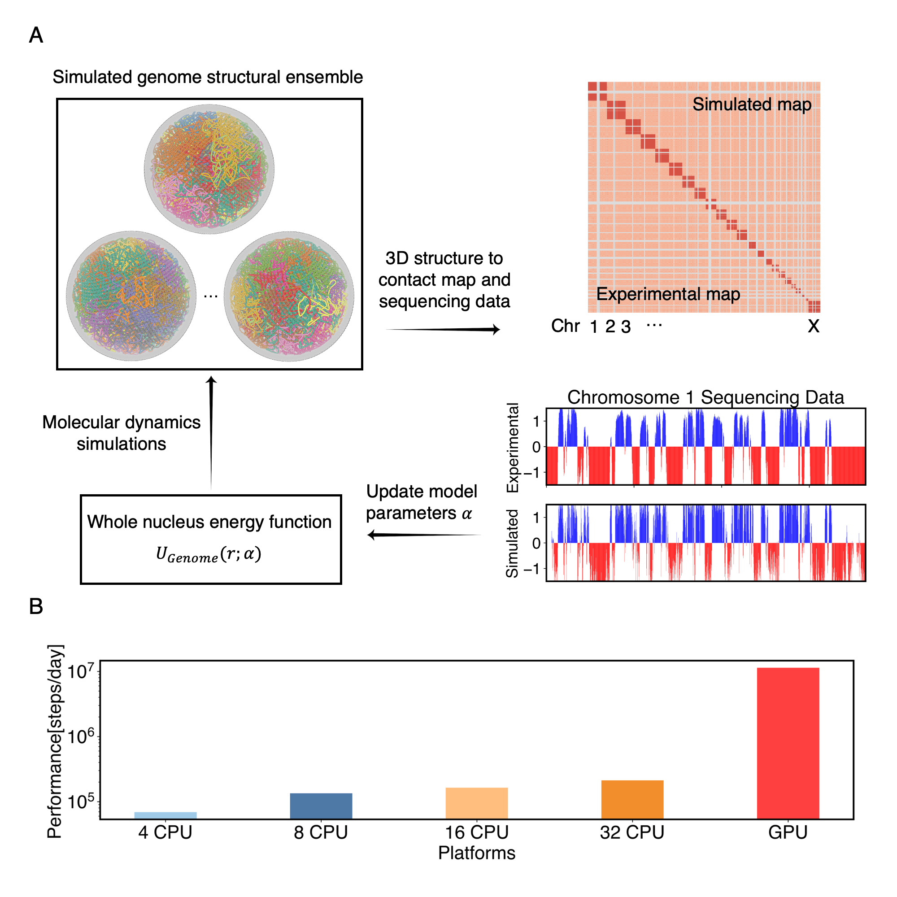

## openNucleome

openNucleome supports OpenMM GPU-accelerated simulations of the three-dimensional architecture of genomes. It is flexible and allows adding the potential for chromosomes-chromosomes and chromosomes-nuclear bodies with custom values. The package dramatically simplifies the simulation setup: users only need a few lines of python code to carry out the genome simulations starting from initial configurations of 46 chromosomes, nucleoli, speckles, and lamina, which form a cell nucleus. The package is integrated with OpenMM, a GPU-accelerated MD simulation engine enabling efficient simulations. We provide tutorials to demonstrate the various capabilities. We anticipate openNucleome to significantly facilitate for simulating the three-dimensinoal architecture of genomes.

## Manual

The output html manual file is docs/index.html. 

The manual is also shown in: 

Instructions for class methods and functions are also included as comments in the source code. 

## Environment

We recommend using openmm 7.5.1 for using openNucleome, as openNucleome is built based on openmm 7.5.1. 

Install openmm 7.5.1 with the following command: 

```
conda install -c conda-forge openmm=7.5.1
```

Other required packages: numpy, mdanalysis, mdtraj.

## Installation

The user can either download the package from github, or use pip install:

```
pip install openNucleome
```

## Workflow for creating the whole nucleus model and efficiency across different platforms



## Examples

We provide an example in examples/HFF_100KB, and we also show how to calculate the contact probabilities and compare with experiments to obtain optimized potential parameters in ./analysis_code.
