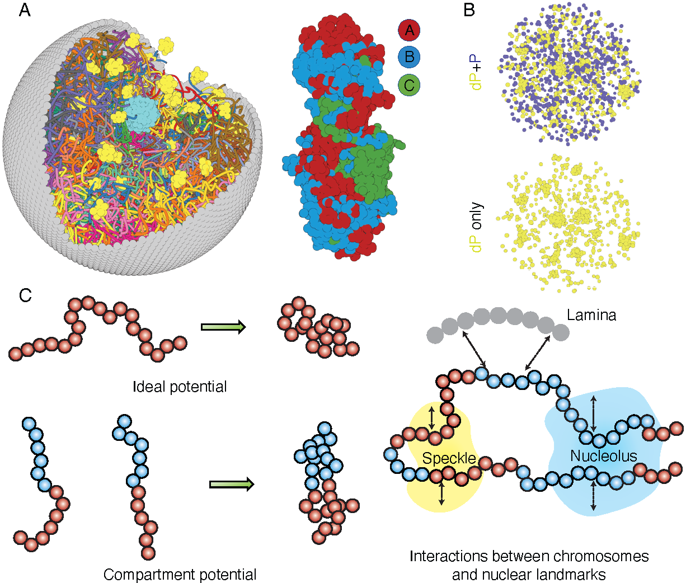

.. _introduction:

============
Introduction
============

`openNucleome <https://github.com/ZhangGroup-MITChemistry/OpenNucleome/>`_ is an open-source software designed for conducting molecular dynamics (MD) simulations of the human nucleus. This software streamlines the process of setting up whole nucleus simulations through just a few lines of Python scripting. OpenNucleome can unveil intricate, high-resolution structural and dynamic chromosome arrangements at a 100 KB resolution. It empowers researchers to track the kinetics of condensate formation and fusion while also exploring the influence of chemical modifications on condensate stability. Furthermore, it facilitates the examination of nuclear envelope deformation's impact on genome organization. The software's modular architecture enhances its adaptability and extensibility. Leveraging the power of OpenMM, a GPU-accelerated MD engine, OpenNucleome ensures efficient simulations.

